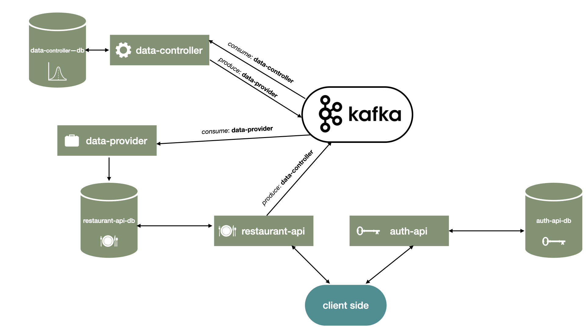

# Restaurant API



## Demo server
Currently, this application deployed to the following server:
http://35.239.219.197

## Postman collections
Please import the following link into your postman application.
https://www.getpostman.com/collections/82c83dd5b6a18306b9eb


## Instruction to run

```shell script
git clone https://github.com/Janoyan/restaurant-api.git

cd restaurant-api

sudo docker-compose build

sudo docker-compose up -d
```


